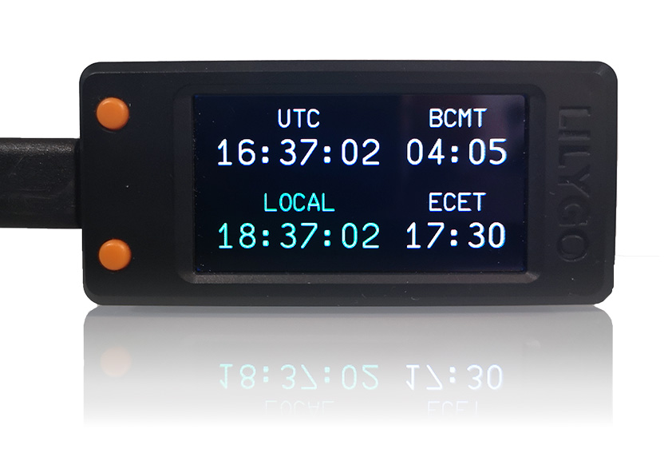

# Aviators Desk Clock

<p align="center">
  
</p>

A custom desk clock for aviators showing the current UTC and local time
as well as BCMT (beginning of civil morning twilight - the start of daytime) 
and ECET (end of civil evening twilight - the start of nighttime).

## Introduction

The clock is kept accurate using NTP synchronization. And will show a
failure if the sync becomes to old. 

It is a custom firmware for the ESP32 based 
[LILYGO  T-Display-S3](https://www.lilygo.cc/products/t-display-s3)
hardware.

## Installation

### Clock configuration

Currently, the location and the timezone of the clocks local time need to be 
configured in the source code in [config.h](src/config.h)

The correct timezone strings can be looked up in the
[TZdef.h of the gmag11/ESPNtpClient](https://github.com/gmag11/ESPNtpClient/blob/main/src/TZdef.h)
project. 

Configuration example:
```
// Set the location of the clock for BCMT and ECET calculation
// the default is Vöslau Airfield in Austria, LOAV
#define LATITUDE 47.964991751824925 // in decimal degrees, with North being positive
#define LONGITUDE 16.26048809382469 // in decimal degrees, with East being positive

// Set the timezone for the local time, the default is Vienna time.
#define TIMEZONE "CET-1CEST,M3.5.0,M10.5.0/3"
```

### Build and upload

It can then be built and uploaded using [platformio](https://platformio.org/).

### WiFi Configuration

The WiFi is configured dynamically using a web interface provided by
[WiFiManager](https://github.com/tzapu/WiFiManager). 
If no WiFi is configured or the WiFi connection times out an access point 
with the SSID "aviators-desk-clock" is opened for configuration management.

You can connect your device to this access point and use the provided web interface 
to set the WiFi SSID and password for the WiFi which the clock should use.

## Usage

### Initial Sync

After booting the clock it will perform it's first NTP sync, which can take
a while, and you will see an INOP flag instead of the time.  

### Buttons

The top of the two front buttons shuts the clock down into a sleep mode 
and wakes it up again. 

The bottom of the two front buttons can be used to switch between the 
debug information page and the clock. 

## Customization

### Fonts

By default, a [font based upon a simulation of the A320 engine indication system](https://github.com/flybywiresim/aircraft/blob/master/fbw-a32nx/src/fonts/ECAMFontRegular_Source.sfd)
is used. 

To replace the font it needs to be converted using the 
[lvgl online font converter](https://lvgl.io/tools/fontconverter)
and can then be loaded and used in [clock_gui.cpp](src/clock_gui.cpp).
